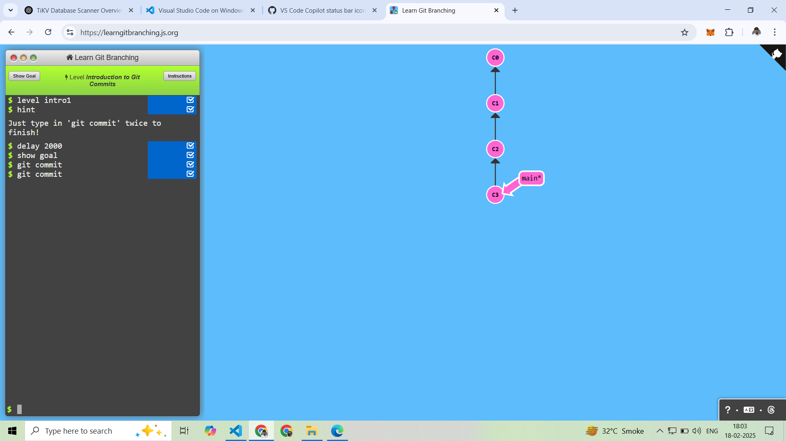
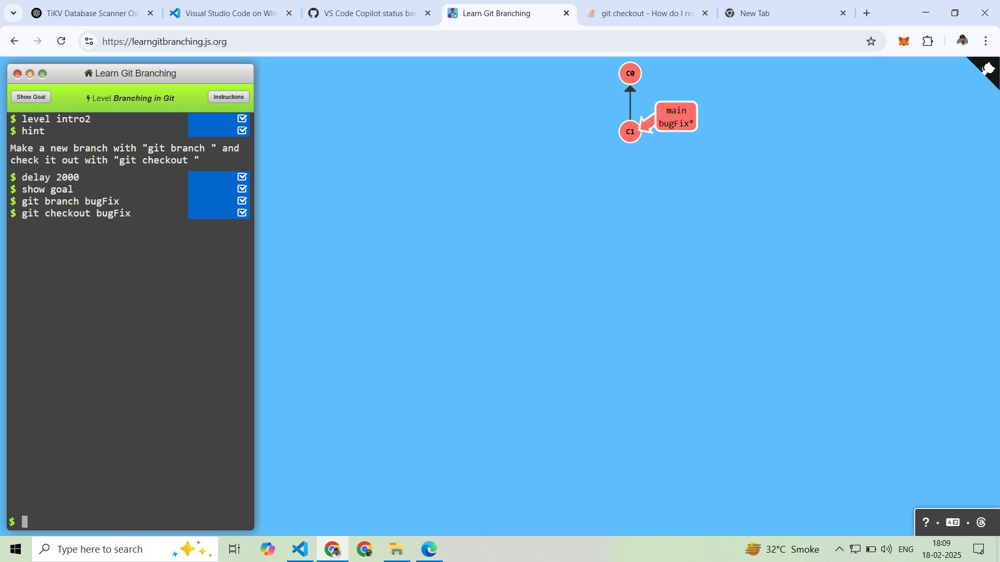
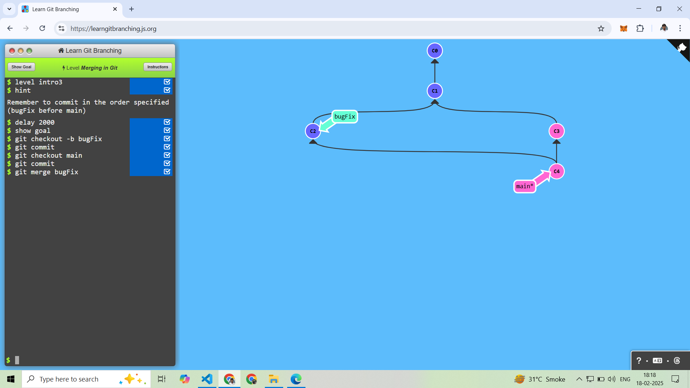
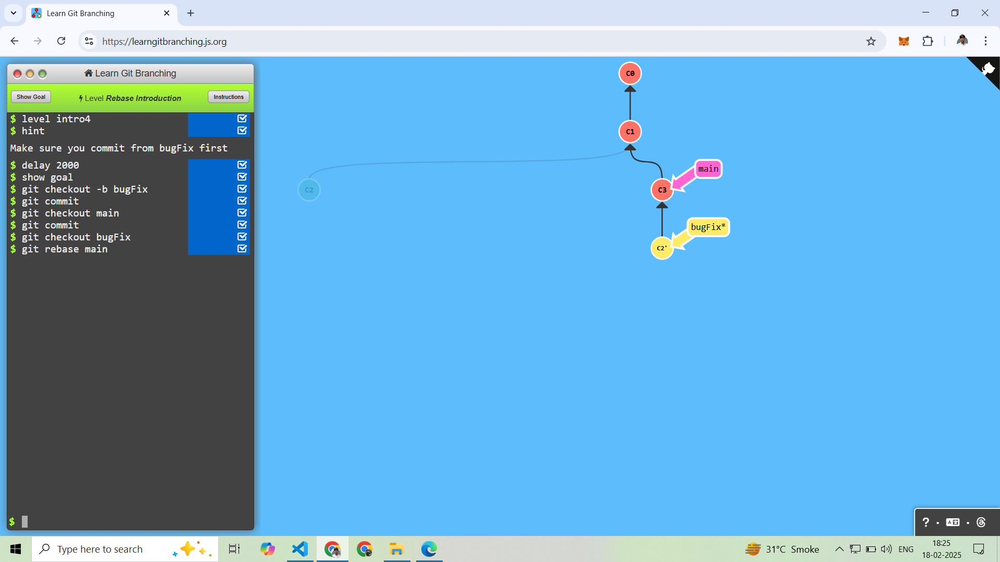

# (1) Introduction Sequence

-------
## 1.Introduction to Git Commits



Github Commit Command is used to save changes to a local repository.

Main Branch in Once Commit:
```
git commit 
```
-------

# 2. Branching in Git

Create New Branch:
``` 
git branch branch_name
git branch bugFix
```

Switch to Branch:
``` 
git checkout branch_name    
git checkout bugFix
```

After Switching to Branch, Commit Changes:
```
git commit 
```



------------
# 3. Merging in Git

Create A New Branch And Switch Both At Once:
```
git checkout -b branch_name

git checkout -b bugFix
```

After Switching to Branch, Commit Changes:
```
git commit 
```

After Switching to main Branch and Commit Changes: 
```
git checkout main
git commit 
```

Merge Branches:
```
git merge branch_name
git merge bugFix
```



--------

# 4. Rebase Introduction

## What is Rebase ? 
Rebase is a way to move the entire feature branch to begin on the tip of the master branch.

Create A New Branch And Switch Both At Once:
```
git checkout -b bugFix
```

After Switching to Branch, Commit Changes:
```
git commit 
```

After Switching to main Branch and Commit Changes: 
```
git checkout main
git commit 
```

After Switching to BugFix Branch and Rebase:
```
git checkout bugFix
git rebase main
```

