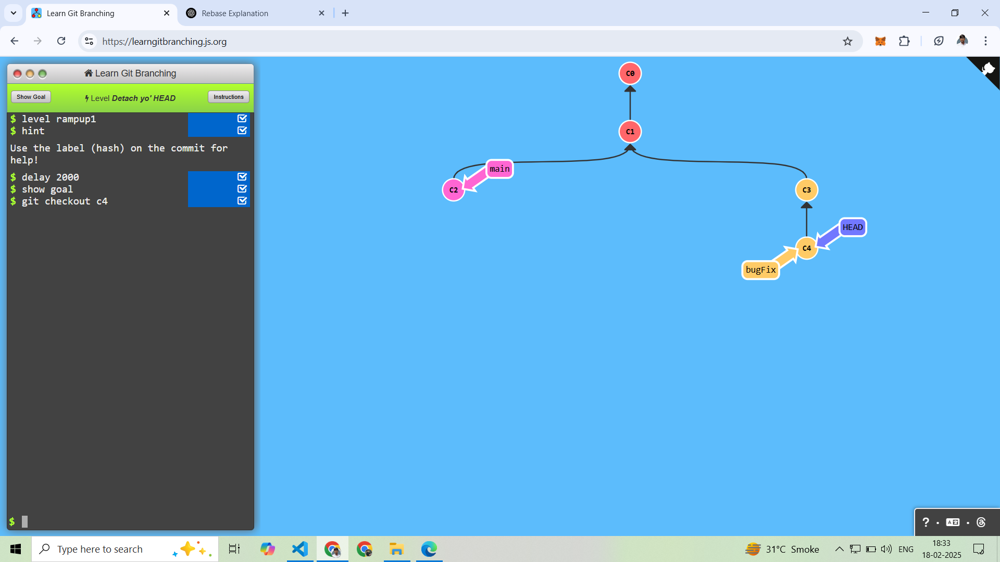
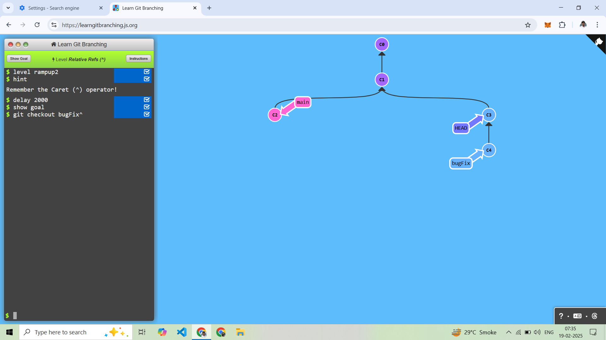
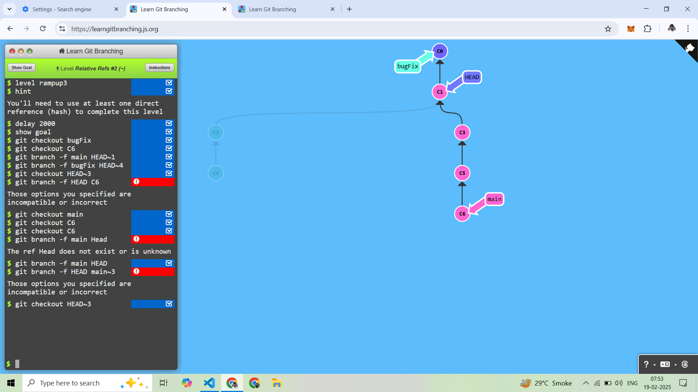
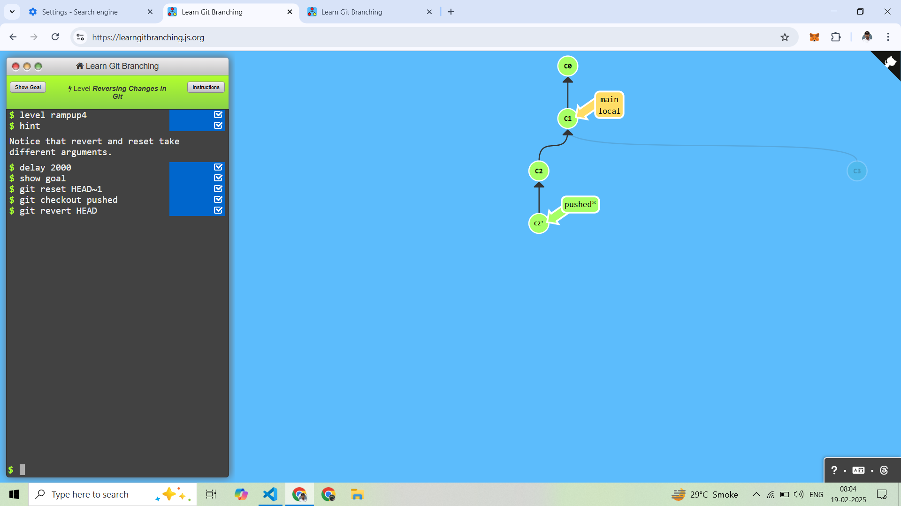

# (2) Ramping Up

--------------------------
## 1. Detach yo' HEAD 
Head Position Display for your current branch work

Head Point to C4 Branch
```
git checkout C4
```


-------------------------------
## 2. Relative Refs (^)

^ Operator is used to reference the parent of a commit. 

Go to the parent of the branch
```
git checkout branchname^
git checkout HEAD^
```


-----------------------------

## 3. Relative Refs #2 (~)

-f Operator is used to reference the parent of a commit.

FIRST HEAD GO FOR C6
```
git checkout C6
```

After Main Branch go to Head
```
git branch -f main HEAD
```

After BugFix Branch Go to C0 Using Head Parent
```
git branch -f bugFix HEAD~4
```

After Head Go for C1
```
git checkout Head~3
``` 



------------------------------
## 4. Reversing Changes in Git

Current Branch is local to Reset 1 Step Back
```
git reset HEAD~1
```

After Checkout Pushed Branch And Revert 1 Step Back
```
git checkout Pushed
git revert HEAD
```



