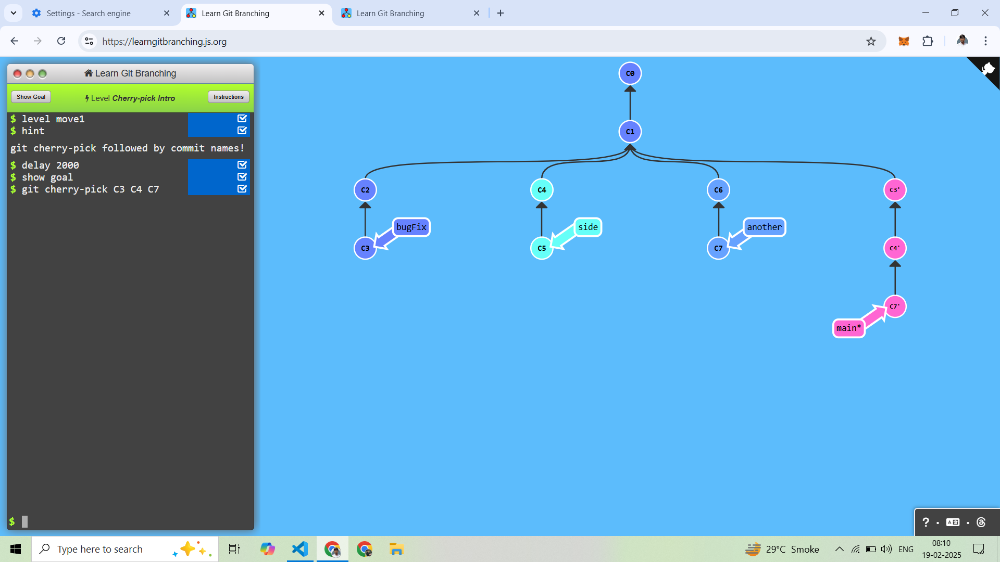
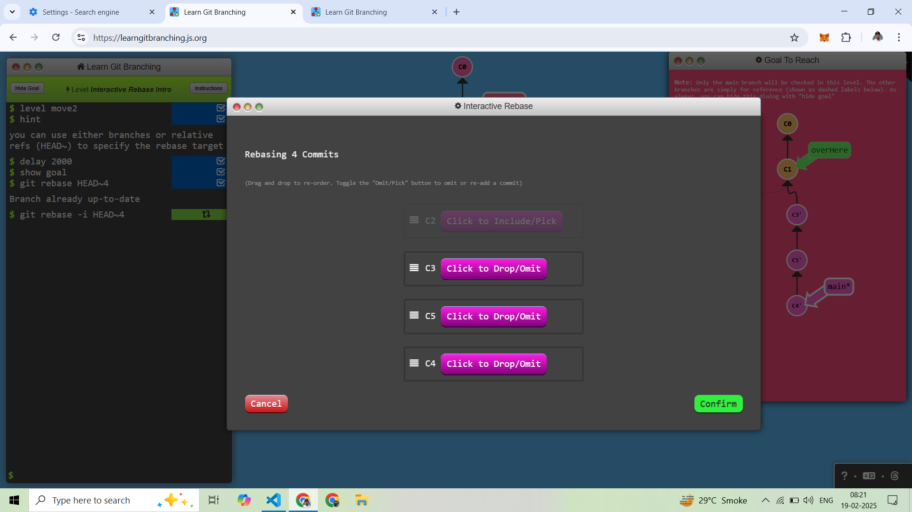
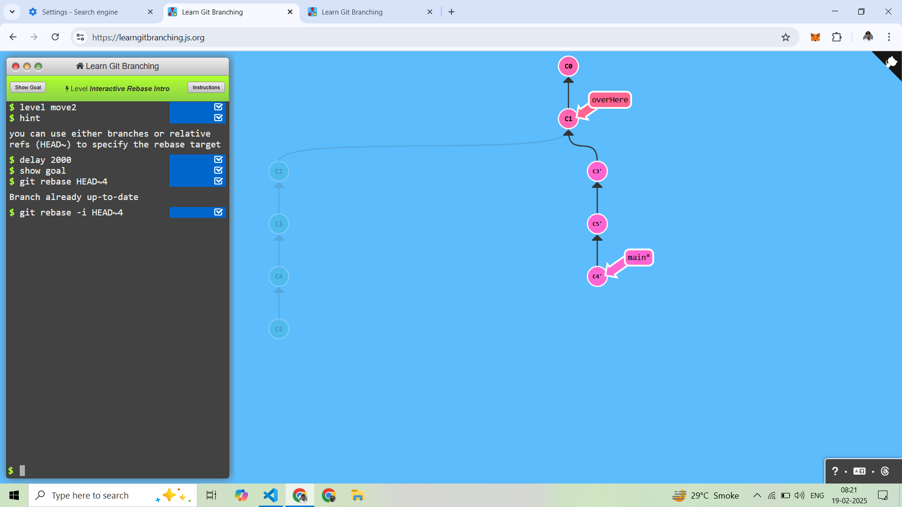

# (3) Moving Work Around
------------------
## 1. Cherry-Pick Introduction

Cherry-Pick is used to copy a commit from one branch to another branch.

Allready Current Branch is Main Branch
Here Main Branch in the Copy c3, c4, c5 Commit
```
git cherry-pick C3 C4 C5
```


-----------------------

## 2. Interactive Rebase Introduction

Rebase is used to change the base of the branch.

Current Branch is Main Branch
```
git rebase -i HEAD~4
```

After Rebase, Main Branch is C3, C4, C5 But Change the Order C5 After C3 and Before C4




