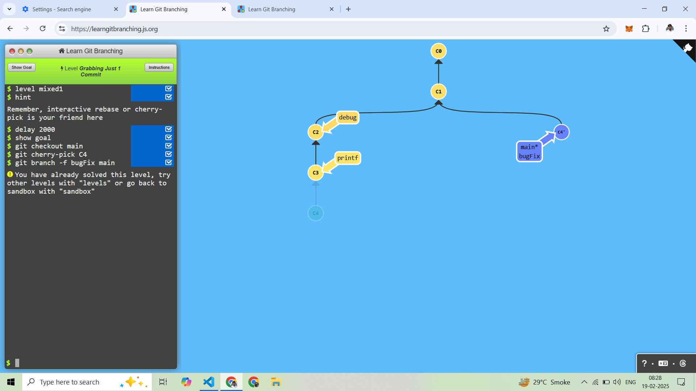
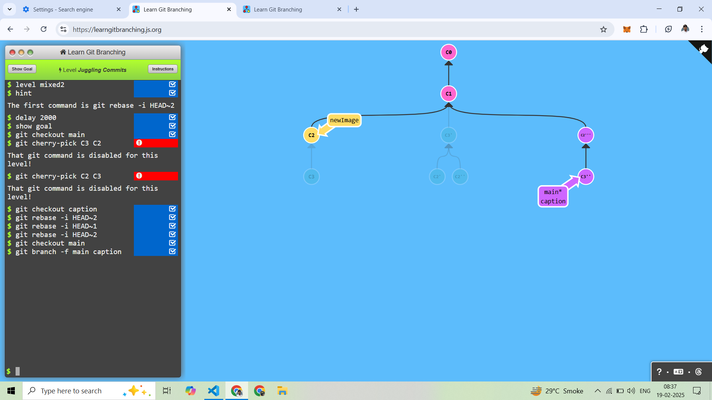
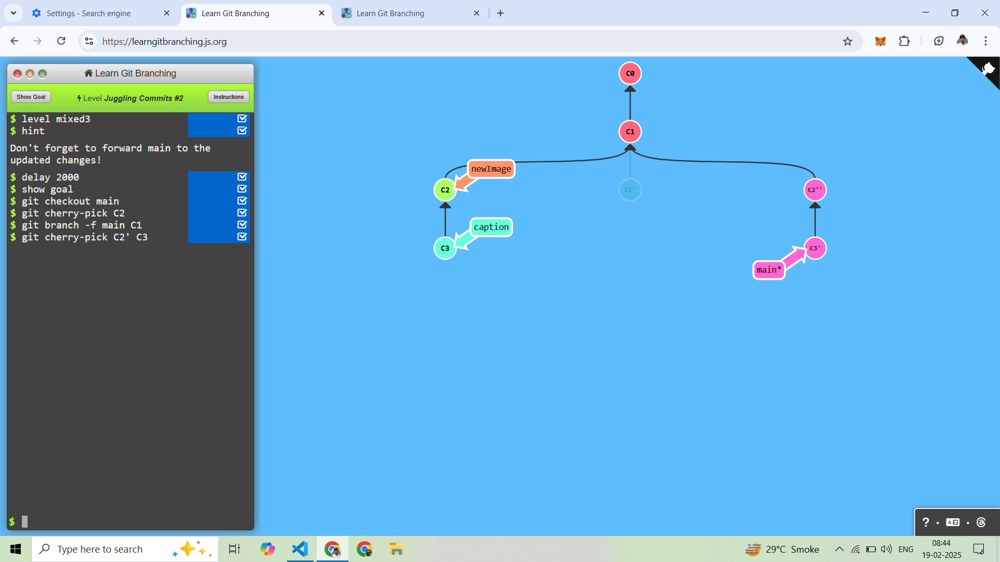
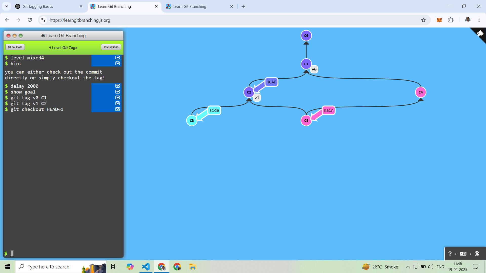
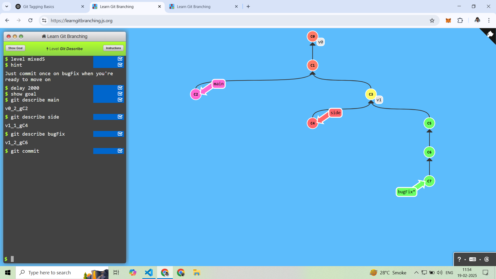

# (4) A Mixed Bag

----------------------
## 1. Grabbing Just 1 Commit 

First Checkout main Branch
```
git checkout main
```

After C4 Commit Copy the Main Branch
```
git cherry-pick C4
```

After BugFix Go For With Main Branch
```
git branch -f bugFix MAIN
```



---------------------------

## 2. Juggling Commits

First Copy C2 and C3 Using Head~2 Here Change the Order C3 After C2
```
git rebase -i HEAD~2
```

After Copy C2 Using Head~1 
```
git rebase -i HEAD~1
```

After Copy C2'' And C3' Using Head~2  And Change the Order C2'' After C3'
```
git rebase -i HEAD~2
```




---------------------------

## 3. Juggling Commits #2


First Checkout Main Branch
After Copy C2
```
git checkout main
git cherry-pick C2
```

After Main Branch Forword to C1
```
git branch -f main C1
```

After Copy C2' and C3
```
git cherry-pick C2' C3
```



---------------------------

## 4. Git Tags

Apply Tag Command
```
git tag tagname commitname
```

v0 Tag Apply to C1 Commit
```
git tag v0 C1
```

v1 Tag Apply to C2 Commit
```
git tag v1 C2
```

go for v1 Tag
```
git checkout HEAD~1
```




---------------------------

## 5. Git Describe

Describe is used to show the latest tag and the number of commits since the tag.

```
git describe
Output : [tagname]_[numberofcommitsAfterTag]_g[commitname]
```

branch wice describe
```
git describe [branchname or commitname]
Output : [tagname]_[numberofcommitsAfterTag]_g[commitname]
```

Describe Branch
```
git describe main
Output : v0_2_gC2
```
```
git describe side
Output : v1_1_gC4
``` 
```
git describe bugFix
Output : v1_2_gC6
```

