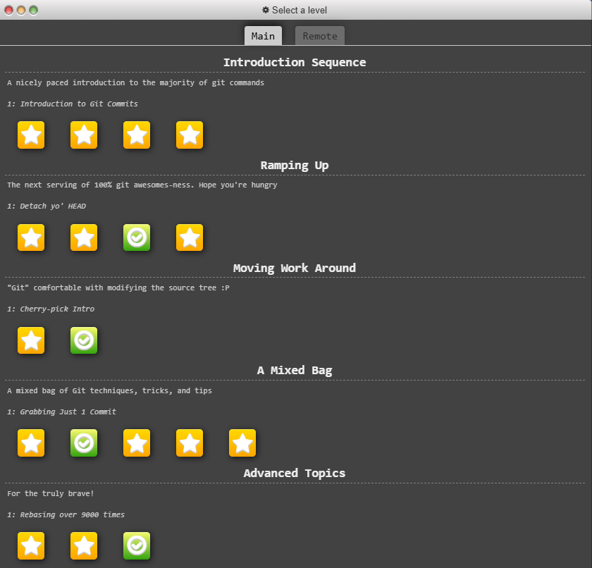

# (5) Advanced Topics

--------------------
## 1. Rebasing Multiple Branches

First main In Rebase Branch BugFix
```
git rebase main bugFix
```

After BugFix In Rebase Branch Side
```
git rebase bugFix Side
```

After Side In Rebase Branch another
```
git rebase Side another
```

After Another In Rebase Branch Main
```
git rebase another main
```


-----------------------
## 2. Specifying Parents

Main To Go For C2 Help of The Head ~ and ^ Operator
```
git checkout HEAD~^2~
```

After Create A Branch From C2
```
git branch bugFix
```

After Checkout main Branch
```
git checkout main
```


One Command Solution Create a Branch From C2 And HEAD As It
```
git branch newBranch HEAD~^2~
```


-----------------------

## 3. Branch Spaghetti

First Checkout Branch : one
```
git checkout one
```

After Copy Commit C4 C4 C2
```
git cherry-pick C4 C4 C2
```

After Checkout Branch : two
```
git checkout two
```

After Copy Commit C5 C4' C3' C2'
```
git cherry-pick C5 C4' C3' C2'
```

After -f Operator Go For C2 Branch : three
```
git branch -f three C2
```


-----------------------

Complete Git Learning From  https://learngitbranching.js.org/


-----------------------