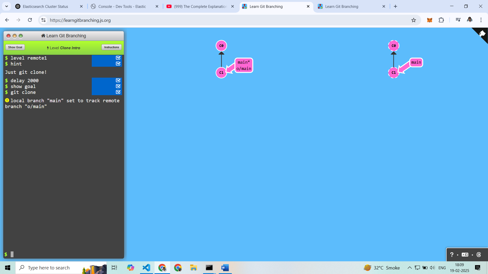
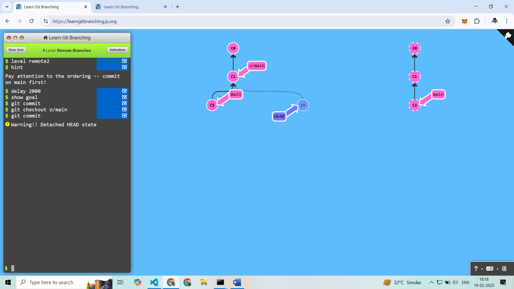
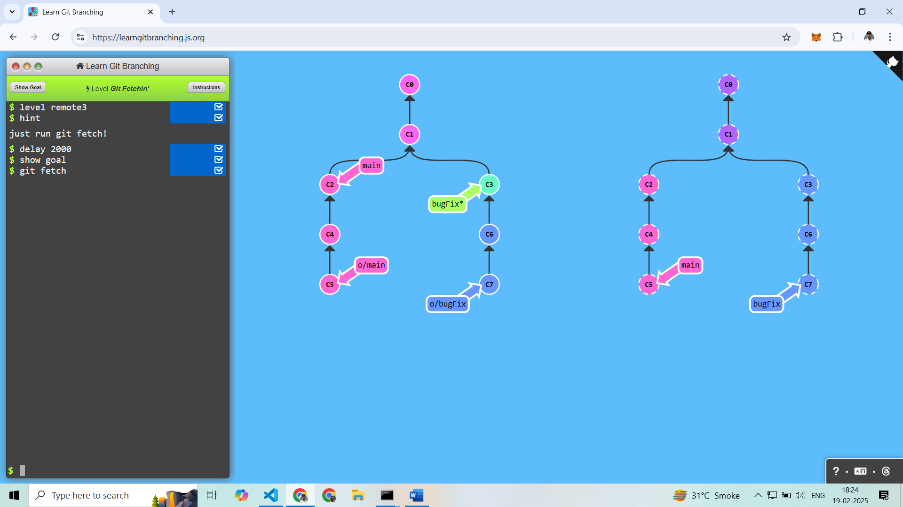
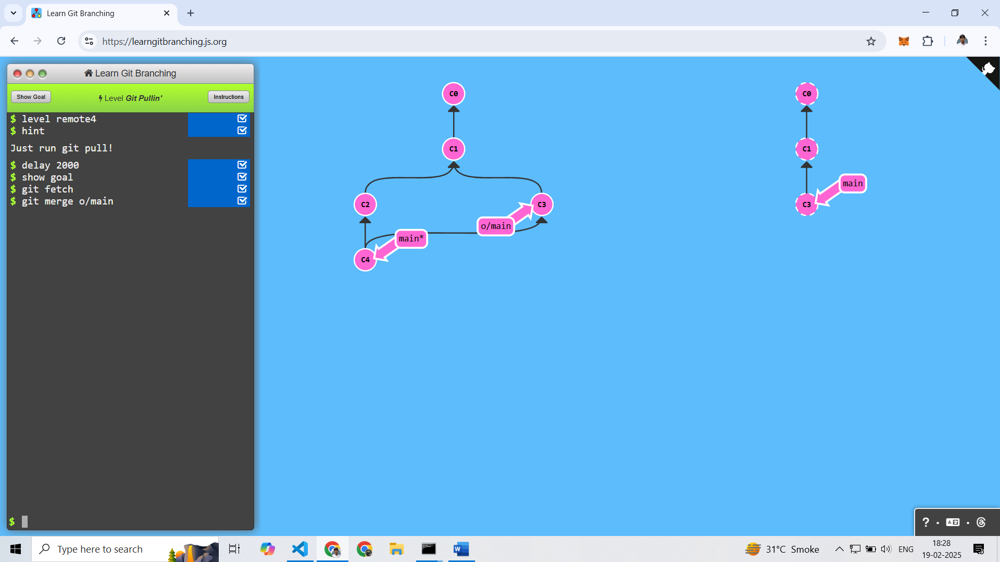
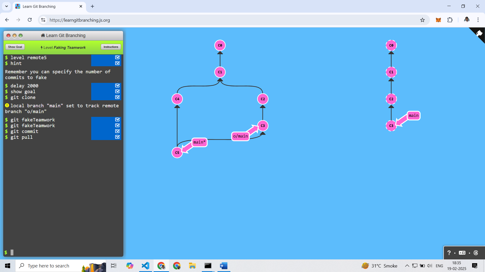
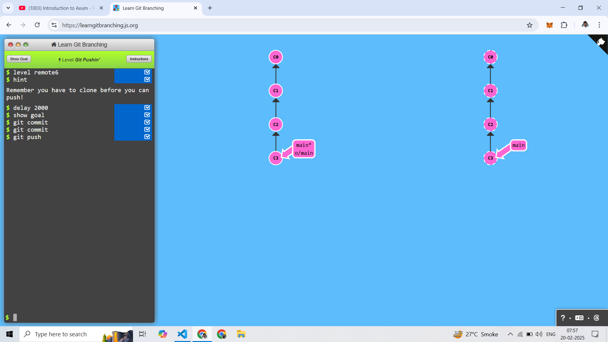
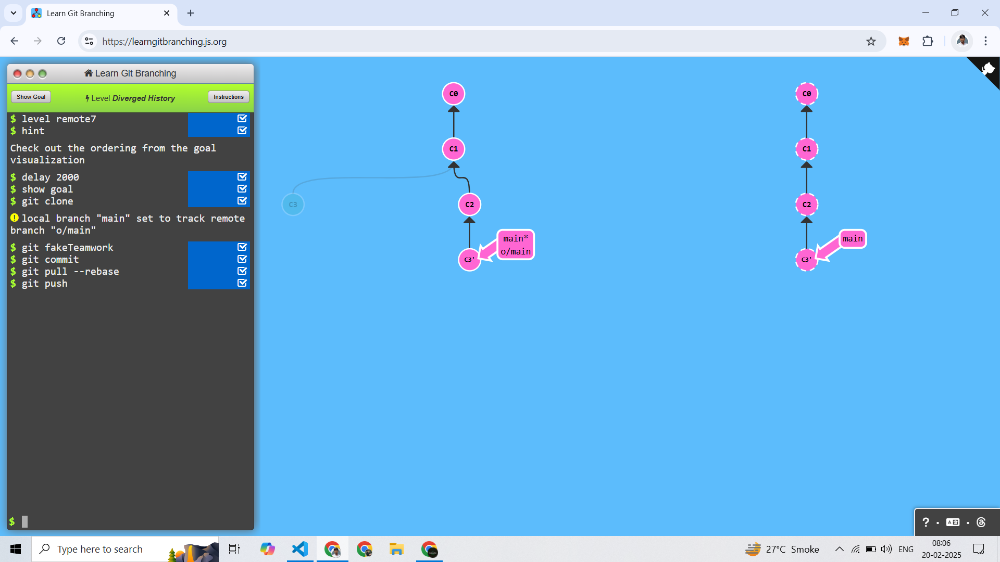
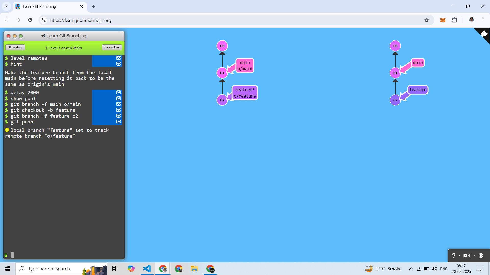
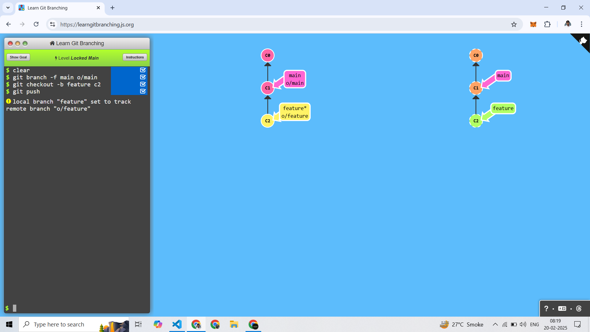

# Push & Pull -- Git Remotes!

---------------------
## 1. Clone

Clone Using Command 
```
git clone
```


---------------------

## 2. Git Remote Branches

C1 Commit to Point 2 Branch name is main and o/main

Allready Current Branch is main
``` 
git commit
```

Switch to Branch o/main
```
git checkout o/main
```

Commit Apply
```
git commit
```




-------------------------

## 3. Git Fetch

Command Use :
```
git fetch
```



----------------------------


## 4. Git Pull

First Try with git fetch and mannually merge
```
git fetch
git merge o/main
```



After I using a git pull Command to (Merge is automatically) 
```
git pull
```


----------------------------

## 5. Simulating collaboration

Remote Branch to Make Commit using Command
```
git fakeTeamwork
```

Clone 
```
git clone
```

After Clone Remote Branch 2 Commit
```
git fakeTeamwork
git fakeTeamwork
```

After One Commit in local 
```
git commit
```

After remote work pull in local 
```
git pull
```



--------------------------

## 6. Git Pushin'

Here 2 Commit in local and Push a remote 
```
git commit 
git commit
git push
```



--------------------------

## 7. Diverged History

First local to send in remote with clone
```
git clone
```

one remote Commit
```
git fakeTeamwork
```

one local commit
```
git commit
```

after pull the remote work with rebase
```
git pull --rebase
```

after local push 
```
git push
```



--------------------------

## 8. Locked Main 

Main Branch to forword o/main Branch
```
git branch -f main o/main
```

after create a new branch name feature
```
git checkout -b feature
```

after feature to forword c2
```
git branch -f feature c2
```

after push
```
git push
```



Shorthand Create Branch checkout With Spacific Location
``` 
git checkout -b feature c2
```




