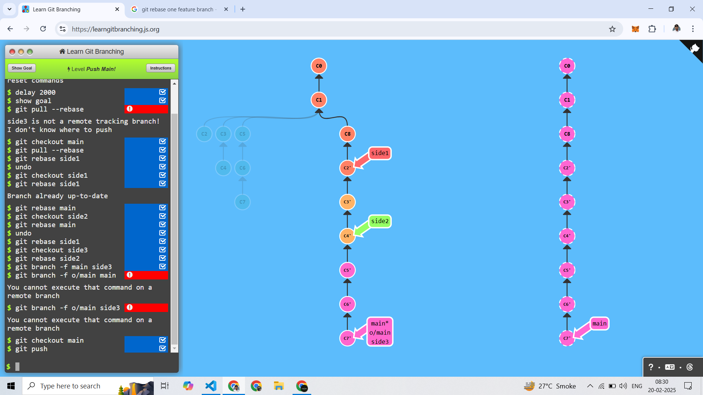
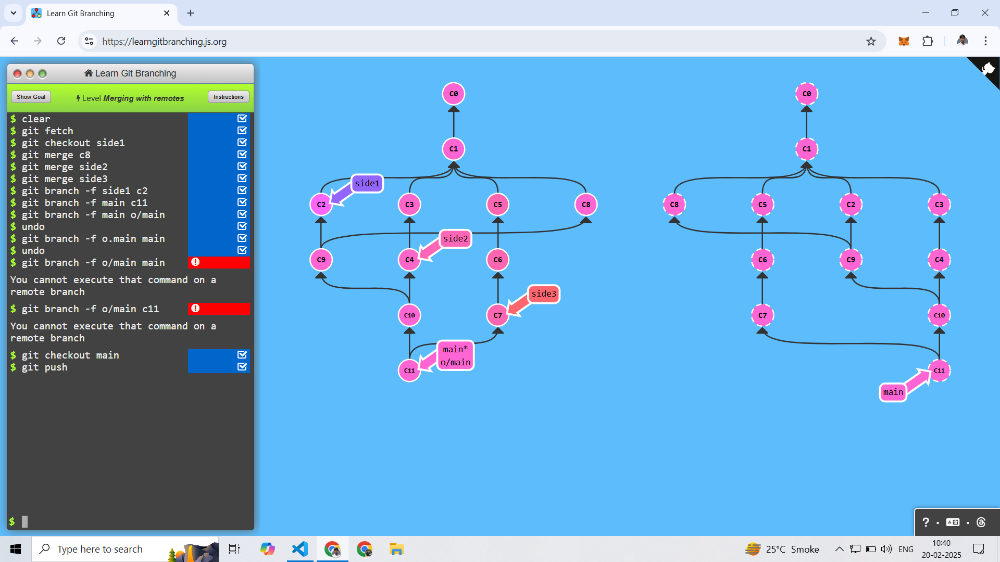
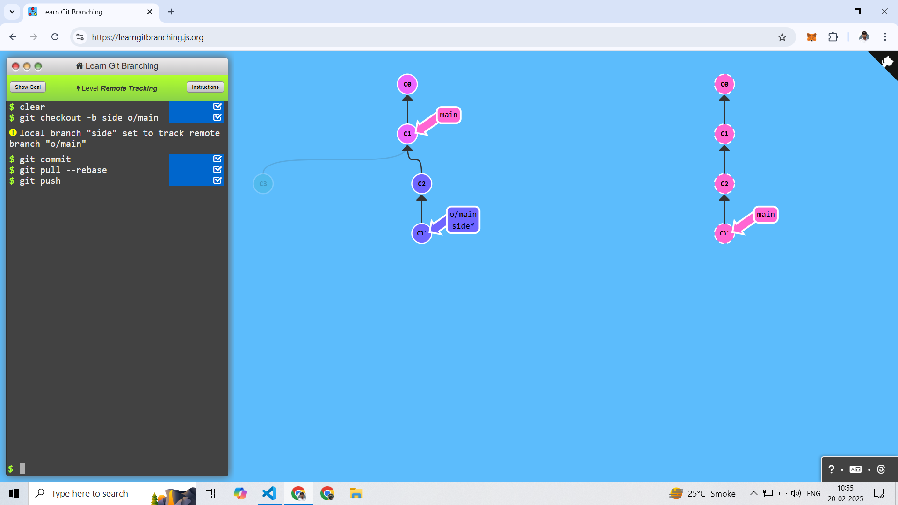
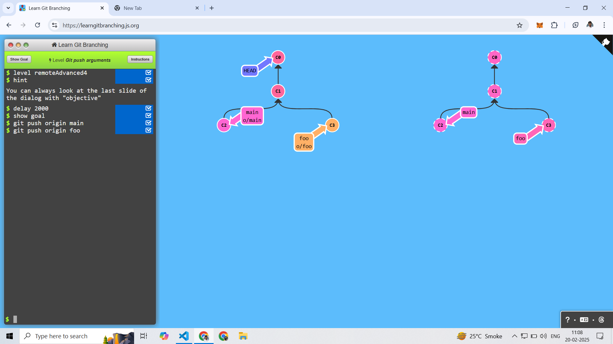
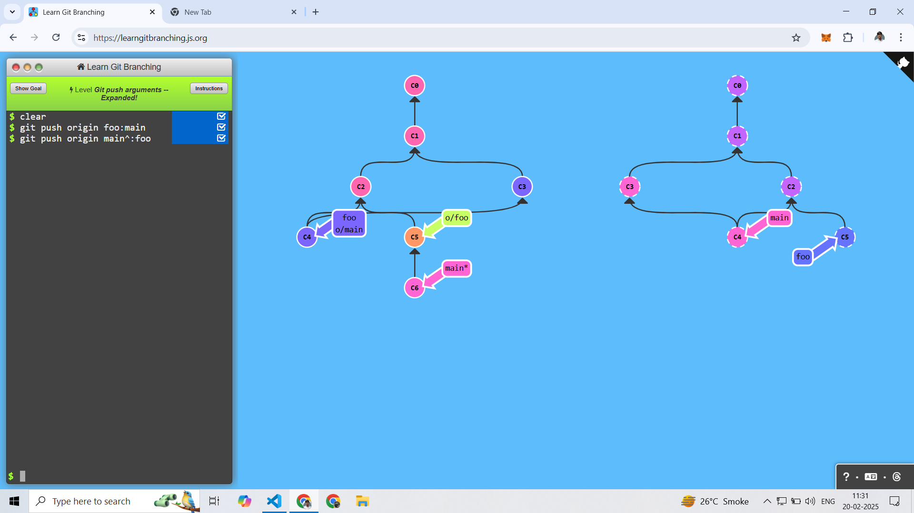
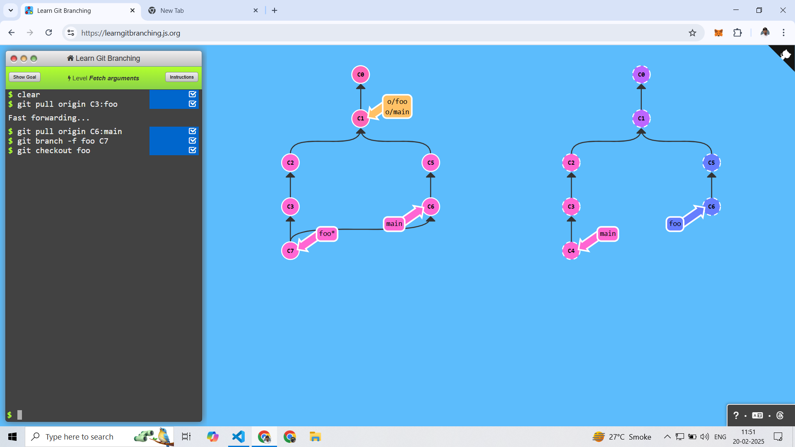
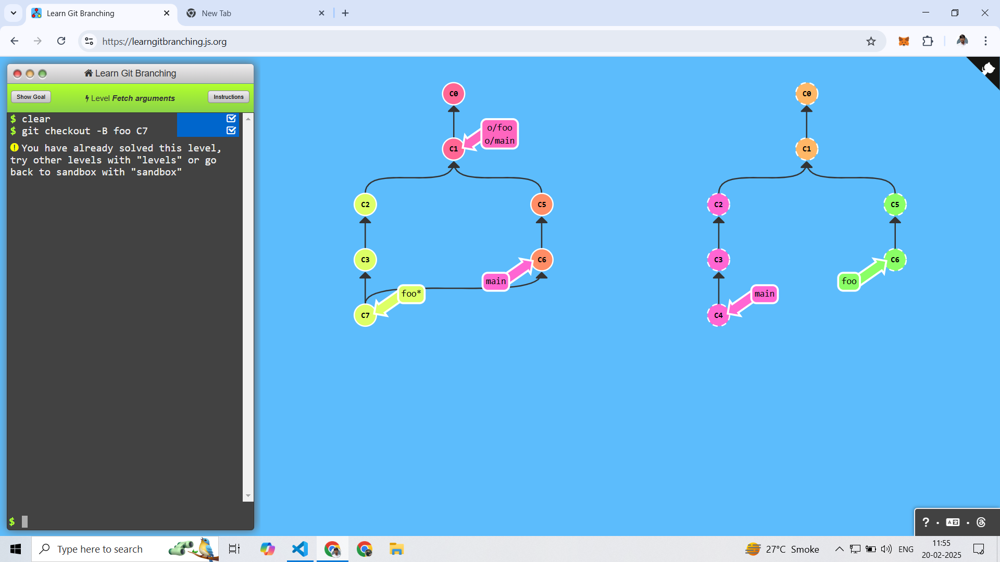
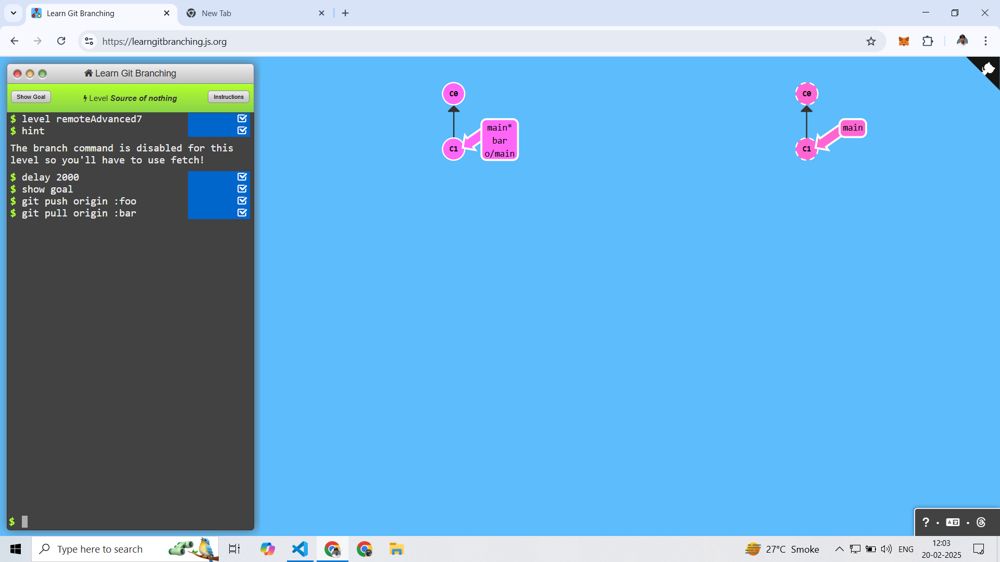
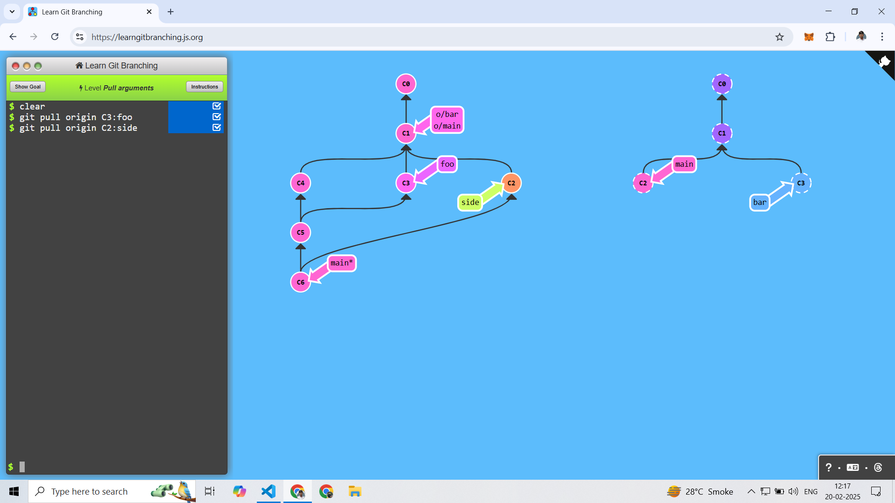

# To Origin And Beyond -- Advanced Git Remotes!

------------------------

## 1. Push Main! 

First Checkout main and pull rebase
```
git checkout main
git pull --rebase
```

After Checkout side1 and rebase on main
```
git checkout side1
git rebase main
```

After Checkout side2 and rebase on side1
```
git checkout side2
git rebase side1
```

After Checkout side3 and rebase on side2
```
git checkout side3
git rebase side2
```

After main forword side3
```
git branch -f main side3
```

After push 
```
git push
```



------------------------

## 2. Merging with remotes 

First Remote Branch Fetch
```
git fetch
```

Go For Branch : side1
```
git checkout side1
```

After Merge C8
```
git merge C8
```

After Merge Branch : side2
```
git merge side2
```

After Merge Branch : side3
```
git merge side3
```

Main Forword c11
```
git branch -f main c11
```

Checkout Branch : main
```
git checkout main
```

After Push 
```
git push
```



------------------------

## 3. Remote Tracking

First Create Branch and Set Remote Tracking
```
git checkout -b side1 o/main
```

After One Commit 
```
git commit
```

After Pull with rebase
```
git pull --rebase
```

After Push
```
git push
```



------------------------

## 4. Git push arguments

Cmd Strcture :  
```
git push <remote> <place>
```

First Push only main Branch
```
git push origin main
```

After Push foo branch
```
git push origin foo
```


------------------------

## 5. Git push arguments -- Expanded!

CMD Structure : 
```
git push <remote> <source>:<destination>
```

Remote in C1 in two Branch foo and Main

Here First Local foo Branch Push in the Remote main Branch
```
git push origin foo:main
```

After Push main One Step Back Commit till to push in the remote foo Branch
```
git push origin main^:foo
```



------------------------

## 6. Fetch arguments


CMD Structure : 
```
git fetch <remote> <source>:<destination>
```

First Fetch the remote till C3 Commit in the local foo branch
```
git fetch origin C3:foo
```

After Fetch the remote till C6 Commit in the local main branch
```
git fetch origin C6:main
```

After Foo Brnach Forword to C7 Commit
```
git branch -f foo C7
```

Checkout foo Branch
```
git checkout foo
```




One Command Forword and Checkout
```
git checkout -B foo C7
```


------------------------

## 7. Source of nothing

Cmd Structure : 
```
git push <remote> :<destination>
git pull <remote> :<destination>
```

First Push 
```
git push origin :foo
```

After Pull
```
git pull origin :bar
```



------------------------

## 8. Pull arguments

First Remote C3 Commit Pull in Local foo Branch
```
git pull origin C3:foo
```

After Remote C2 Commit Pull in Local side Branch
```
git pull origin C2:side
```



------------------------