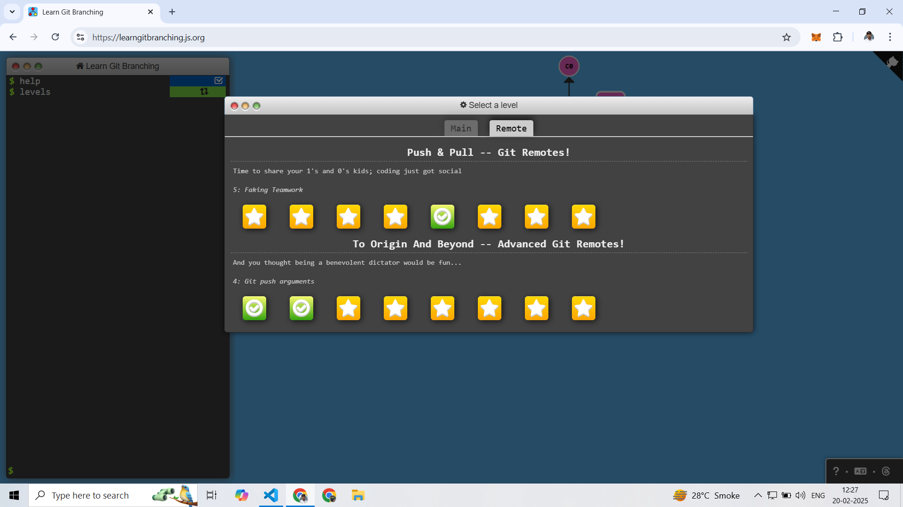

# Learn_git_branch


Here Topic Wice Directory Structure is as Readme.md file.:


Main :
``` 
1_Intruduction_Sequences.md
2_Ramping_Up.md 
3_Moving_Work_Around.md
4_A_Mixed_Bag.md
5_The_Final_Push.md
```

Remote :
```
6_Remote_Push_Pull.md
7_Remote_Advance_Git.md
```
---------------------
Complete Git Learning From  https://learngitbranching.js.org/

## Local:


## Remote :


----------------------